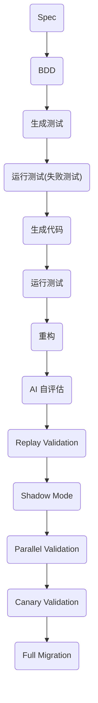

```mermaid
flowchart TD;
    spec(Spec) --> bdd(BDD)
    bdd --> tests(生成测试) 
    tests --> runTestsFail("运行测试(失败测试)")
    runTestsFail --> code(生成代码)
    code --> runTest(运行测试)
    runTest --> refactor(重构)
    refactor --> aiEvaluation(AI 自评估)
    aiEvaluation --> replay(Replay Validation)
    replay --> shadow("Shadow Mode")
    shadow --> parallel(Parallel Validation)
    parallel --> canary(Canary Validation)
    canary --> migration(Full Migration)
    

```